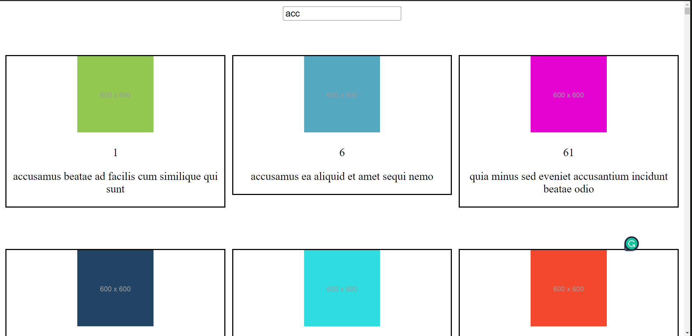

# Debouncing-Throttle-Custom-HOOK

--> App.jsx:

App.jsx is a functional React component that renders an input element, as well as two custom components named Debounced and Throttled. The useState hook is used to create two state variables, input and globalData. The useFetch hook is used to make a network request to retrieve data from an API endpoint.
The Debounced and Throttled components take in four props each: data, input, globalData, and setGlobalData. The purpose of these components is to provide a debounced or throttled version of the data prop based on the user input in the input prop. The resulting data is then stored in the globalData state variable using the setGlobalData function.
To use this component, you would need to import the useEffect and useState hooks from the react module, as well as any necessary dependencies like the useFetch hook, Debounced and Throttled components, and any required CSS files or images. The component can then be rendered in your application as <App />. The Debounced and Throttled components can be included or excluded as needed, depending on the desired functionality of the application.

--> Debounced.jsx: 

The Debounced component is a custom React component that utilizes the useDebounce hook to debounce the user input received from the parent component. The component then filters the data prop based on the debounced input value and updates the globalData state variable using the setGlobalData function.
The useEffect hook is used to execute the filtering logic only when the debounced input value changes. Within the useEffect, the data is filtered based on the debounced value and then passed to the globalData state variable using the setGlobalData function.
The resulting filtered data is then mapped over and displayed using the SinglePage component, which is rendered in a grid layout.
This component requires the useEffect and useDebounce hooks to be imported from the react and ../Hook/useDebounce modules, respectively. It also requires the SinglePage component to be imported from the ./SinglePage module. Finally, this component needs to receive four props from its parent component: input, globalData, setGlobalData, and data.
To use this component, you would need to import the Debounced component and include it in the parent component's render function with the necessary props passed in.

--> Throttled.jsx: 

The Throttled component is a custom React component that utilizes the useThrottle hook to throttle the user input received from the parent component. The component then filters the data prop based on the throttled input value and updates the globalData state variable using the setGlobalData function.
The useEffect hook is used to execute the filtering logic only when the throttled input value changes. Within the useEffect, the data is filtered based on the throttled value and then passed to the globalData state variable using the setGlobalData function.
The resulting filtered data is then mapped over and displayed using the SinglePage component, which is rendered in a grid layout.
This component requires the useEffect and useThrottle hooks to be imported from the react and ../Hook/useThrottle modules, respectively. It also requires the SinglePage component to be imported from the ./SinglePage module. Finally, this component needs to receive four props from its parent component: input, globalData, setGlobalData, and data.
To use this component, you would need to import the Throttled component and include it in the parent component's render function with the necessary props passed in.

--> useFetch.js:

This is a custom React hook named useFetch which performs an HTTP GET request and manages its state using useReducer hook. The hook returns an object containing the current state of the request.
The useReducer hook takes in a reducer function, an initial state object, and returns the current state and a dispatch function which is used to update the state.
The reducer function takes in the current state and an action object, and returns the new state based on the action type and payload. The initialState object contains the initial state of the request with loading, data, and error properties set to false, [], and false respectively.
The ACTIONS object contains the types of actions that can be dispatched by the dispatch function. When FETCH_LOADING action is dispatched, the reducer sets the loading and error properties to true. When FETCH_SUCCESS action is dispatched, the reducer sets the loading and error properties to false and sets the data property to the payload value. When FETCH_ERROR action is dispatched, the reducer sets the loading property to false and sets the error property to true.
The useEffect hook is used to perform the HTTP GET request when the component is mounted. It dispatches the FETCH_LOADING action before the request is made and dispatches either FETCH_SUCCESS or FETCH_ERROR action based on the response. The empty dependency array passed as the second argument to useEffect ensures that the request is made only once when the component is mounted.
Finally, the hook returns an object with the current state of the request wrapped in an object. It is recommended to always prefer object export instead of array export.

--> useDebounced.js: 

The useDebounce hook is a custom React hook that returns an object with a single property called debouncedVal. The purpose of this hook is to throttle the input received from the parent component and return the debounced input value after a certain delay has elapsed.
This hook utilizes the useEffect hook, which takes in a function and an array of dependencies as arguments. Whenever any of the dependencies change, the function is executed.
The useDebounce hook takes two arguments, input and delay. The input argument is the user input received from the parent component, and the delay argument is an optional parameter that specifies the duration of the debounce delay in milliseconds. The default value for the delay argument is 2000 milliseconds (or 2 seconds).
The hook then initializes two state variables: debouncedVal and debouncedID. The debouncedVal state variable holds the debounced input value, and the debouncedID variable holds the ID of the setTimeout function that will be used to delay the input.
Within the useEffect hook, the debouncedID is set to the ID of a setTimeout function. This setTimeout function is responsible for delaying the execution of the input update logic for the specified delay duration. After the delay has elapsed, the setDebouncedVal function is called with the current input value.
The useEffect also returns a cleanup function that clears the timeout ID stored in the debouncedID variable. This ensures that any previous setTimeout functions are cleared before a new one is set.
Finally, the hook returns an object with a single property, debouncedVal, which holds the debounced input value. This value can be accessed by the parent component that calls this hook.
To use this hook, you would need to import the useEffect, useState, and useRef hooks from the react module. You would then call the useDebounce hook in the parent component and pass in the input value and the optional delay value. The hook will return an object with the debounced input value that can be used within the parent component.

--> useThrottle.js: 

The useThrottle custom hook is used to throttle user input updates. It takes an input and a delay as arguments, and returns a state value called throttleVal. The throttleVal is the input value, but it is updated only after a certain amount of time has elapsed since the last update.
The useState hook is used to define the state variable throttleVal, which holds the current value of the input after throttling. The initial value of throttleVal is an empty string. The useRef hook is used to define a mutable reference variable throttleID, which is used to keep track of the timer ID.
Inside the useEffect hook, the throttleID.current variable is checked to determine if there is already an active timer. If there is no active timer, a new timer is started with setTimeout. The setTimeout function sets the throttleID.current variable to false after the specified delay has elapsed. This ensures that subsequent updates to the input value will trigger the setTimeout function again.
When the timer expires, the setThrottleVal function is called with the current input value as its argument. This updates the throttleVal state variable with the latest input value after the specified delay has elapsed since the last update.
Finally, the useThrottle hook returns an object with the throttleVal state value. This value can be used by the parent component to render the updated input value after throttling.

